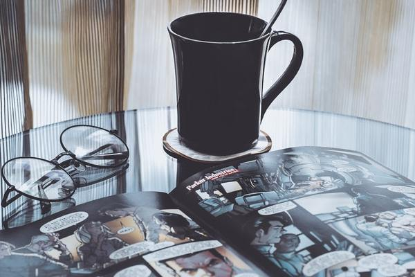

#### Stripwinkel Beo

##### Introductie

Voor de stripwinkel Beo heb ik hun huidige website in een nieuw jasje gestoken door gebruik te maken van HTML & CSS.
De huidige website maakt geen gebruik van een lay-out of grid waardoor het op een rommeltje lijkt. 

##### Software

1. HTML 5
2. CSS
3. SASS
4. Bootstrap

##### Wanneer?

Ik heb dit gecodeerd op 9 mei 2019

##### Wat is het probleem van de huidige website?

De huidige website wordt nog vernieuwd met nieuwe acties, strips etc. Maar de lay-out is een rommel, er is geen begin of geen einde. De elementen en tekst staan overal en nergens. Er is geen basis grid waarop ze zich hebben gebaseerd. Ik vraag me zelfs af of er wel iets van css-layout is in verwerkt. Lelijke fonts, teveel kleur, teveel onodige beelden. Nergens het zelfde witgebruik of spacing. Ik heb meer het gevoel dat het een plakboek is dan een website.

##### Wat heb ik eraan gedaan?

Ik heb gewerkt met flexbox, zo ontstaat er een lay-out waarbij wel is nagedacht. Daarnaast heb ik gekozen voor ruime groote beelden. De teksten staan mooi uitgelijnd en passen bij het totale beeldje. Doordat ik heb gewerkt met divs en containers ontstaan er vakken waarin mijn paragrafen minder chaotisch overkomen dan bij de huidige website. 

> Beo:

> Na veertig jaar verkoopt Beo (59) nog steeds met evenveel passie strips en gadgets bij stripwinkel Beo. “De grootste beloning is klanten in tranen zien als ze hét ontbrekende exemplaar gevonden hebben.”

##### Code
as you can see I worked a bit with flexbox cause it's really handy to use and get your elements where you want to have them.
It's a easy way with your flex container too style it.

```  <div  class="flex-container">
      
      <p class ="welkom"> <strong>Welkom</strong><br> op de website van <strong>Stripwinkel Beo,</strong> sinds 1977 het kloppende hart van de strip. Als u een liefhebber van stripverhalen bent, op zoek naar een leuk cadeau  of bezeten van graphic novel, kan je deze site van  A tot Z doorzoeken  Lees verder ...  Online bestellen is vanaf nu mogelijk, u kunt nog altijd uiteraard via e-mail bestellen. Strips online kopen (of bestellen en zelf ophalen) is nu kinderspel, even registreren,inloggen, kiezen en bestellen...De laatste nieuwe strips staan nu op de website, klik op "nieuw" of hier  voor een overzicht.<br> <button class="button">Lees Meer</button> </p>
    </div>```
    
    
   
